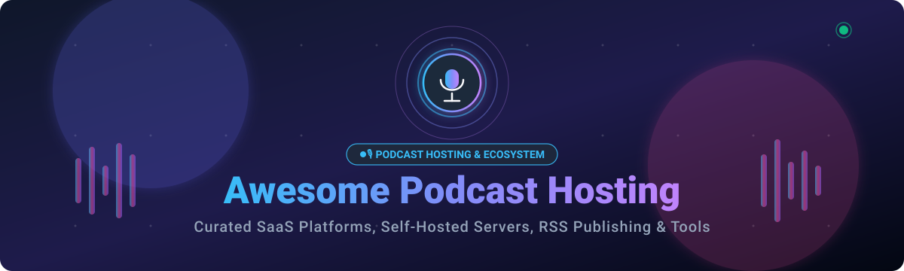

# 🎙️ Awesome Podcast Hosting 

 
 

 
 

**🎧 A Curated Directory of SaaS Platforms, Self-Hosted Servers, RSS Publishing Systems, Analytics Engines, and Developer Tools for Podcast Creators and Engineers.**

*Discover top-tier podcast hosting solutions, compare company sizes, analyze transparent pricing tiers and free limits, and explore open-source alternatives with real-time GitHub community metrics.*

---

## 📑 Table of Contents

- [✨ Overview](#-overview)
- [☁️ SaaS / Hosted Platforms](#️-saas--hosted-platforms)
- [💻 Open-Source GitHub Projects](#-open-source-github-projects)
- [🌟 Additional Strong Open-Source Options](#-additional-strong-open-source-options)
- [🤝 How to Contribute](#-how-to-contribute)
- [📈 Star History](#-star-history)
- [📜 Disclaimer](#-disclaimer)

---

## ✨ Overview

Welcome to the **Awesome Podcast Hosting** ecosystem guide! 🚀 Whether you are an independent creator launching your very first audio show, an enterprise broadcasting a global network, or a software engineer self-hosting your media stack with open RSS standards and Podcasting 2.0 namespaces, this curated catalog provides comprehensive and factual insights.

Key highlights covered in this repository:
- **Audio & Video Podcast Distribution**: RSS 2.0 generation, Apple Podcasts, Spotify, YouTube republishing, and Amazon Music ingestion.
- **Audience Growth & Analytics**: IAB v2 certified metrics, listener geolocation, retention graphs, and user-agent tracking.
- **Monetization & Dynamic Audio**: Programmatic ad insertion (DAI), private subscriber feeds, premium memberships, and listener tips.
- **Self-Hosted Infrastructure**: Complete Dockerized podcast servers, headless CMSs, media archivers, and embeddable web audio players.

---

## ☁️ SaaS / Hosted Platforms

Below is a comparison table of prominent commercial podcast hosting platforms, sorted in descending order by **Company Scale (Estimated Annual Revenue / Valuation / Group Scale)**.

| Product | Company Scale / Valuation | Description | Starting Price | Free Tier / Trial Limits |
| :--- | :--- | :--- | :--- | :--- |
| **[Libsyn](https://libsyn.com/)** | **~$58.7M+ Annual Revenue** (Publicly traded: `LSYN`) | 📻 Long-running podcast hosting and distribution network providing media hosting, RSS feeds, analytics, advertising, and custom websites. | $8/month (Bare Essentials tier) | **30-Day Free Trial**: Full platform trial with initial storage allowance; no permanent free tier. |
| **[Simplecast](https://simplecast.com/)** | **~$28M Acquisition Valuation** (Subsidiary of SiriusXM / AdsWizz) | 📊 Industry-standard podcast hosting and analytics platform providing publishing, RSS feeds, custom players, and audience management. | $15/month (or $150/year) | **14-Day Free Trial**: Full access to Basic plan features (up to 20,000 monthly downloads, 2 team seats); no permanent free tier. |
| **[RSS.com](https://rss.com/)** | **~$16.5M Valuation** (~$5.5M ARR) | 🌐 Modern podcast hosting platform providing unlimited audio episodes, RSS feeds, analytics, websites, and Podcasting 2.0 feature support. | $15/month (or $8.25/month billed annually) | **Free Plan ("Free Local & Niche")**: Unlimited episodes and storage, 1 podcast feed, with analytics history capped at the last 30 days. |
| **[RedCircle](https://redcircle.com/)** | **~$8M Total VC Funding** (Series A) | 💰 Creator-first podcast hosting and monetization platform offering dynamic advertising, listener donations, subscriptions, and cross-promotions. | $14.99/month (Growth tier) | **Free Plan ("Core")**: Unlimited storage, unlimited downloads, and monetization access; limited to 200 MB per episode file size with platform revenue share. |
| **[Podbean](https://www.podbean.com/)** | **~$6.5M Annual Revenue** (Bootstrapped / High Scale) | 📱 Podcast hosting and publishing platform offering podcast websites, mobile apps, listener analytics, live streaming, and monetization. | $9/month (billed annually) or $14/month (billed monthly) | **Free Plan**: 5 hours (500 MB) total storage, 100 GB monthly bandwidth, max 3 episodes/day, and max 100 MB per episode. |
| **[Buzzsprout](https://www.buzzsprout.com/)** | **~$5.6M+ Annual Revenue** (Bootstrapped Market Leader) | 🎙️ Audio/video podcast hosting, RSS distribution, customizable websites, advanced analytics, dynamic content, and automatic transcription. | $12/month (billed annually) or $14/month (billed monthly) | **Free Plan**: Up to 2 hours of audio upload per month; episodes hosted for 90 days only. |
| **[Castos](https://castos.com/)** | **~$3.6M Annual Revenue** (~$756K funding) | 🚀 Podcast hosting platform offering unlimited storage and downloads, private podcasting, automated transcription, and YouTube republishing. | $19/month (or $190/year) | **14-Day Free Trial**: Full access to Essentials plan features (unlimited downloads/podcasts, 10 monthly transcripts, 100 private subscribers); no permanent free tier. |
| **[Transistor](https://transistor.fm/)** | **~$3.0M+ Annual Revenue** (Bootstrapped Indie Pioneer) | 🎧 Professional podcast hosting supporting unlimited podcasts, RSS feeds, analytics, podcast websites, private podcasts, and team collaboration. | $19/month (or $190/year) | **14-Day Free Trial**: Full access to Starter plan features (up to 20,000 monthly downloads, 50 private subscribers); no permanent free tier. |
| **[Transistor for Business](https://transistor.fm/)** | **~$3.0M+ Annual Revenue** (Transistor Enterprise division) | 🏢 Enterprise podcast hosting infrastructure for companies and agencies managing multiple shows with high-volume downloads and custom branding. | $99/month (or $990/year) | **14-Day Free Trial**: Full access to Business tier features (up to 250,000 monthly downloads, 3,000 private subscribers, branding removal); no permanent free tier. |
| **[Spreaker](https://www.spreaker.com/)** | **Acquired by iHeartMedia / Voxnest** (~$1.52M early funding) | 📡 Podcast hosting, live broadcasting, distribution, analytics, and programmatic monetization platform for independent and enterprise creators. | $20/month (Broadcaster tier) | **Free Plan ("Free Speech")**: Up to 5 hours total audio storage, 1 podcast feed, 6 months analytics history, with ad monetization included. |
| **[Captivate](https://www.captivate.fm/)** | **Acquired by Global Media Group** (Major UK Broadcast Giant) | 🎯 Podcast hosting and marketing platform focused on audience growth, analytics, built-in websites, private podcasts, and monetization. | $17/month (billed annually) or $19/month (billed monthly) | **30-Day Free Trial**: Full access to all platform features (Personal tier with up to 30,000 monthly downloads); no permanent free tier. |
| **[Fireside](https://fireside.fm/)** | **Bootstrapped Niche Specialist** (by Dan Benjamin) | ⚡ Podcast hosting and publishing platform providing custom podcast websites, media hosting, detailed stats, and custom domain support. | $9/month (Starter tier) | **14-Day Free Trial**: Full access to Starter plan features (1 podcast, up to 5 episodes/month, 10,000 monthly downloads); no permanent free tier. |

---

## 💻 Open-Source GitHub Projects

Explore self-hosted podcast hosting engines, managers, media streamers, and RSS publishing suites. The list is sorted in descending order by **GitHub Star Count**.

- **[Audiobookshelf](https://github.com/advplyr/audiobookshelf)**   
  📚 Self-hosted audiobook and podcast server with streaming capabilities, automatic episode fetching, multi-user management, and companion mobile apps.

- **[Winds](https://github.com/GetStream/Winds)**   
  🌊 Beautiful open-source RSS reader and podcast application powered by React, Node.js, and Stream.

- **[AntennaPod](https://github.com/AntennaPod/AntennaPod)**   
  📱 Easy-to-use, flexible, and completely open-source podcast manager and player for Android with full RSS feed subscription and offline caching support.

- **[Podcastfy](https://github.com/souzatharsis/podcastfy)**   
  🤖 Open-source GenAI alternative to NotebookLM: transforms multimodal content, PDFs, websites, and text into conversational multilingual audio podcasts.

- **[Microfeed](https://github.com/microfeed/microfeed)**   
  ⚡ A lightweight, self-hosted Content Management System (CMS) on Cloudflare for podcast audio, blogs, videos, and media feeds with zero server management.

- **[SoulX-Podcast](https://github.com/Soul-AILab/SoulX-Podcast)**   
  🎙️ High-fidelity conversational podcast voice synthesis and audio generation inference framework from raw text scripts.

- **[Podgrab](https://github.com/akhilrex/podgrab)**   
  📥 Lightweight self-hosted podcast manager and archiver written in Go that automatically downloads new podcast episodes with an integrated web player.

- **[Podsync](https://github.com/mxpv/podsync)**   
  🔄 High-performance daemon that turns YouTube and Vimeo channels, playlists, or user feeds into valid, downloadable podcast RSS feeds.

- **[PinePods](https://github.com/madeofpendletonwool/PinePods)**   
  🌲 Comprehensive Rust-powered self-hosted podcast management system for streaming, tracking listening history, downloading, and multi-user library management.

- **[Castopod](https://github.com/ad-aures/castopod)**   
  🚀 Full-featured open-source podcast hosting platform built with PHP and ActivityPub (Fediverse) integration, dynamic analytics, interactive episode transcripts, and Podcasting 2.0 support.

- **[MediaDrop](https://github.com/mediadrop/mediadrop)**   
  📼 Video, audio, and podcast publishing platform written in Python designed for delivering rich multimedia catalogs.

- **[Python Feedgen](https://github.com/lkiesow/python-feedgen)**   
  🐍 Robust Python library to generate ATOM feeds, RSS feeds, and Apple/iTunes compliant Podcast feeds programmatically.

- **[Podcast Generator](https://github.com/PodcastGenerator/PodcastGenerator)**   
  🛠️ Open-source self-hosted podcast publishing web application with automated feed generation, web admin interface, and episode media manager.

- **[Anytime Podcast Player](https://github.com/amugofjava/anytime_podcast_player)**   
  🎧 Clean, minimalist open-source podcast player application written with Flutter and Dart for cross-platform playback.

- **[Podcast-dl](https://github.com/lightpohl/podcast-dl)**   
  💾 Modern CLI tool for downloading and archiving podcast RSS feeds with concurrency and metadata preservation.

- **[Tsacdop](https://github.com/tsacdop/tsacdop)**   
  ✨ Beautiful, privacy-focused open-source podcast player built with Flutter offering playlist grouping and audio chapter navigation.

- **[Shikwasa](https://github.com/jessuni/shikwasa)**   
  🎶 Lightweight, ultra-customizable web audio player crafted specifically for podcast embedding and playback controls.

- **[PodFetch](https://github.com/SamTV12345/PodFetch)**   
  ⚡ Fast, efficient, and lightweight podcast downloader and local server written in Rust with Giga-scale caching.

- **[Podcast Namespace](https://github.com/Podcastindex-org/podcast-namespace)**   
  🏛️ Official specification and repository for the Podcasting 2.0 namespace standard (transcripts, value-for-value, chapters, persons, soundbites).

- **[Podigee Podcast Player](https://github.com/podigee/podigee-podcast-player)**   
  🎛️ Feature-rich, embeddable, and responsive HTML5 audio player designed specifically for professional podcast embedding.

- **[Astropod](https://github.com/manuelernestog/astropod)**   
  🚀 Serverless, JAMstack open-source podcast website and hosting template built on top of Astro, deployable for free on Vercel, Netlify, or GitHub Pages.

---

## 🌟 Additional Strong Open-Source Options

Looking for more specialized podcast development tools? Here are more open repositories:

| Repository | GitHub Stars | Focus Area |
| :--- | :--- | :--- |
| **[Open Podcast API](https://github.com/openpodcast/api)** |  | Unified analytics scraping and aggregation engine for Spotify, Apple, and web hosts |
| **[Podcast4j](https://github.com/yusufyilmazfr/podcast4j)** |  | Java client implementation for the PodcastIndex.org API |
| **[Simple Podcast Server](https://github.com/makaho/simple-podcast-server)** |  | Lightweight personal feed generator and self-hosted audio server |
| **[Go Podcast](https://github.com/alextanhongpin/go-podcast)** |  | Clean, robust Golang package for podcast RSS feed encoding and parsing |

---

## 🤝 How to Contribute

Contributions to **Awesome Podcast Hosting** are warmly welcomed! 🎉

1. 🍴 **Fork** the repository.
2. 🌿 **Create a branch**: `git checkout -b add-my-tool`
3. 📝 **Add your entry**: Ensure links are accurate, descriptions are objective, starting prices / free limits are specified for SaaS, and repositories include official GitHub stargazer badges.
4. 📬 **Submit a Pull Request**: Provide a concise summary of the addition in your PR description.

---

##  Star History

---

## 📜 Disclaimer

*All product names, logos, and brands are property of their respective owners. Pricing tiers, trial limits, and financial metrics are compiled based on publicly available data as of August 2026 and are subject to change.*
